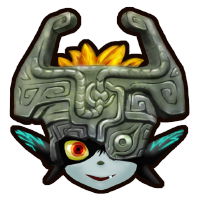

# <a href="http://tehurn.com/tp" target="_blank" rel="noopener noreferrer"></a> tpgz

Twilight Princess ROM hack to practice speedrunning.

[tpgz.io](https://tpgz.io) - Patch your ISO using our web patcher  
(For patching offline, follow this [guide](./docs/CreatingAnIso.md))

⚠️ tpgz is still in early development.<br>
If you have questions or need help, ask in the [#tools-dev](https://discord.gg/m2vmcyT) channel of the [TP Speedrunning Discord](https://discord.gg/tp).

## Features

Use L+R+dpadDown to open the main menu which contains the following options:

```
cheats menu:
- infinite air                  // Gives Link infinite air underwater
- infinite arrows               // Gives Link 99 arrows
- infinite bombs                // Gives Link 99 bombs in all bags
- infinite hearts               // Link will always have full hearts
- infinite oil                  // Gives Link infinite lantern oil
- infinite rupees               // Link will always have 1000 rupees
- infinite slingshot            // Gives Link 99 slingshot pellets
- invincible                    // Makes Link invincible (no hurtbox, but can still take fall damage and drown)
- invincible enemies            // Makes some enemies invincible (infinite health)
- moon jump                     // Hold R+A to moon jump
- door storage                  // Can walk through most objects/walls
- super clawshot                // Clawshot is long, fast, and can grab most things
- unrestricted items            // Link can use any item anywhere
- transform anywhere            // Link can transform into/from wolf anywhere
- super spinner (TBD)           // Spinner is very fast and can hover (not implemented yet)

flags menu:
- general flags                 // Toggle various general flags
- dungeon flags                 // Toggle various dungeon flags
- portal flags                  // Toggle warp portal flags
- temp flags                    // Toggle local temporary flags
- flag log                      // Toggle logging flag changes*

general flags menu:
- boss flag                     // Set the boss flag value. Press A to lock the value
- epona stolen                  // Toggle flag for Epona being stolen
- epona tamed                   // Toggle flag for Epona being tamed
- map warping                   // Toggle flag for having map warping
- midna charge                  // Toggle flag for Midna charge
- midna healthy                 // Toggle flag for Midna being healthy/sick
- midna on back                 // Toggle flag for Midna appearing on Wolf Link's back
- midna on z                    // Toggle flag for being able to use Midna
- transform/warp                // Toggle flag for transforming/warping
- wolf sense                    // Toggle flag for having wolf sense

dungeon flags menu:
- have map                      // Toggle dungeon map for current dungeon
- have compass                  // Toggle compass for current dungeon
- have boss key                 // Toggle boss key for current dungeon
- have small keys               // Toggle small keys for current dungeon
- miniboss dead                 // Toggle miniboss defeated state
- boss dead                     // Toggle boss defeated state
- clear flags                   // Clear all dungeon flags

inventory menu:
- item wheel                    // Set the 24 item wheel slots to any item
- pause menu                    // Modify the pause menu collection
- amounts menu                  // Modify ammo / collectible amounts

memory menu:
- watches                       // Add memory watches to the screen
- editor                        // Browse and edit the memory

practice menu:
- Load practice files* (supports popular Any%, 100%, and All Dungeons locations)

scene menu:
- disable bg music*             // Disables background and enemy music
- disable sfx                   // Disables sound effects (item, weather, etc.)
- freeze actors                 // Freezes actors
- freeze camera                 // Locks the camera in place
- hide actors                   // Hides actors
- hide hud                      // Hides the heads-up display
- time (hrs)                    // The current in-game hour
- time (mins)                   // The current in-game minutes

settings menu:
- area reload behavior          // load area = Reload last area; load file = Reload last file
- cursor color                  // Changes the color of the cursor in TPGZ's menus (green, blue, red, orange, yellow, purple)
- font                          // Changes TPGZ menu font
- drop shadows                  // Adds shadows to all font letters
- menu position                 // Changes the position of various menus and tools from TPGZ
- save card                     // Save settings to memory card
- load card                     // Load settings from memory card

tools menu:
- area reload                   // Use L+R+Start+A to reload current area
- fast bonk recovery            // Reduces bonk animation significantly
- fast movement                 // Link's movement is much faster
- gorge checker                 // Use L+Z to warp to Kakariko Gorge
- umd checker                   // Practice Universal Map Delay (UMD) timing
- input viewer                  // Show current inputs
- link debug info               // Show Link's position, angle, and speed
- no sinking in sand            // Link won't sink in sand
- roll checker                  // Frame counter for chaining rolls
- teleport                      // dpadUp to set, dpadDown to load
- turbo mode                    // Hold an input to continously trigger
- timer                         // Timer: Z+A to start/stop, Z+B to reset
- load timer                    // Loading timer: Z+B to reset
- igt timer                     // In-game Time frame timer: Z+A to start/stop, Z+B to reset
- free cam                      // Z+A+B to activate, Stick/L/R to move, C-stick to look, Z to speed-up
- move link*                    // L+R+Y to activate, Stick to move, C-stick to move/change angle, Z to speed-up
- link tunic color:             // Changes Link's tunic color (green, blue, red, orange, yellow, white, or cycle)

warping menu:
- type                          // Change stage sort type
- stage                         // Select stage to load
- room                          // Select room of stage to load
- spawn                         // Select Link spawnpoint ID
- layer                         // Select stage layer (leave as default unless necessary)
- warp                          // Load selected stage info
- save                          // Set savefile location to selected location (need to be in pause menu)
```

### Known Issues

```
- disabled bg music tool may not always disable bg music
- loading practice files can crash in certain situations
- using move link tool, link is stuck to the ground unless entering a falling state
- some flags not logged by flag logger yet
```

### Planned Features

```
- actor spawner
- frame advance
- collision viewer
- lag counter
```

## Contributing

We'd love for you to help out on `tpgz`! See [CONTRIBUTING.md](./CONTRIBUTING.md) for how to get started.

## Building

Tired of waiting for the next release? See [BUILDING.md](./BUILDING.md) to learn how to create local builds.
